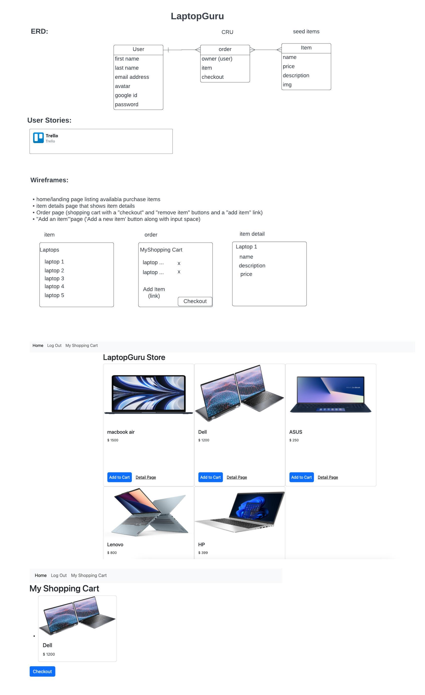

# Planning for LaptopGuru app
On home page of your e-commerce app see a full list of the items you can purchase. Click login and see your shopping cart appearing on a new tab. Click on purchasing items to add them to your shopping cart. Click a button under your order to checkout. 

## Wireframes the UI◊
App's pages:

    - home/landing page listing availabla purchase items
    - item details page that shows item details
    - Order page (shopping cart with a "checkout" and "remove item" buttons and a "add item" link)
    - Add an item'"page ('Add a new item' button along with input space)

   
   Trello Link:
   https://trello.com/b/w3IPvvKn/user-stories

## Technologies I used:
- HTML
- CSS
- JavaScript
- Express
- Passport
- Google People API

# Getting Started:
Check out your e-commerce app:

## Next Steps:
- Be able to see past orders
- Add graphics
- See a cart icon on items page that shows you how many items you have added to the cart
- Add make a payment feature
